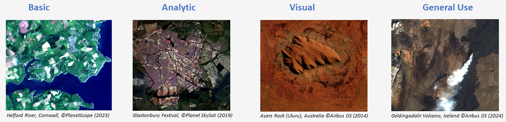
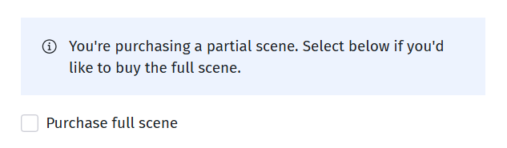

# Ordering commercial data

## Understanding the ordering options

### Getting started

The following guidance walks through the requirements for each field in the ordering interface, step by step. Before attempting to order any commercial data, you must first link your account using an API key which is self-served from the commercial provider. This allows you to fetch a quote for the image you are looking to purchase. If your workspace is not linked with an API key, an error message will flag at the point of purchase, preventing you from fetching a quote.

### Filling out the order options

#### Workspace

Select a workspace for the private data delivery. You can select any workspace from those that you have been added to or created yourself. The data you purchase will be shared with, and accessible to, all members who are in the selected workspace. Make sure the workspace you select is linked via a valid API key, so that the commercial data quote can be fetched. If you still have issues fetching a quote despite your account being linked, it could be that your API key has expired and you need to refresh it.

#### Product bundle

The product bundle is selected from a dropdown menu of 4 available options, outlined below. This field indicates the level of preprocessing required from your imagery order. For example, Basic is the most raw version of the image with the least preprocessing, generally more useful for scientists, while Visual has the most preprocessing stages, enhanced to support easy map visualisations for novice users.

!!! note
    === "Visual"

        A simple map accurate image analogous to an aerial photo. Immediately recognisable, with no specialist EO data expertise. Natural colour, 8-bit RGB image - should be opened by any system - just like a consumer digital camera image, only georeferenced. Orthorectified, pansharpened, natural colour. Suitable for visual mapping applications, image backing for GIS applications, AI computer vision analysis - training and deployment. Suitable for all users.

    === "General Use"
        
        Orthorectified, pansharpened (where applicable) multi-spectral imagery to support general mapping and analytic applications. Calibrated to reflectance. Ready for immediate use - no calibration or data fusion required. Suitable for general image analysis and classification, land cover and land use analysis, and visual mapping applications.

    === "Analytic"
        
        Orthorectified, multispectral imagery to support scientific applications. Calibrated to reflectance. Supplied as a bundle (where applicable) to maintain the radiometric integrity of each band. Orthorectified, reflectance. Suitable for spectroscopy and physical modelling, empirical modelling, precision agriculture and biophysical modelling, and image classification. More aligned to EO specialists.

    === "Basic"
    
        A multi-spectral image close to the natural image aquired by the sensor, aimed to give the user close to full automomy over the data processing chain. Imagery in sensor geometry and corrected for sensor distortions, and co-registration of spectral bands (multispectral and panchromatic). Contains RPCs and sensor model. Imagery is calibrated to remove sensor affects (such as CCD array equalisation), but has no further radiometric processing and can be considered 'Raw'. Not orthorectified or radiometrically corrected. Suitable for precision ortho-rectification, photogrammetry, data calibration and atmospheric correction, and 3D modelling. For EO and photogrammetry specialists.

!!! note

    Open Cosmos orders do not require a Product Bundle field

The Product Bundle you select on EODH is mapped to a set of products delivered by Planet or Airbus in the order, according to the tables below.

##### Planet bundle mappings
The list of bundles Planet provides, with the assets in each bundle, can be found [here](https://docs.planet.com/develop/apis/orders/product_bundles/).

| Item Type      | Product Bundle   | Product Name(s)                            |
|----------------|------------------|--------------------------------------------|
| PSScene        | Visual           | visual                                     |
| PSScene        | General Use      | analytic_udm2, analytic_8b_udm2            |
| PSScene        | Analytic         | analytic_sr_udm2, analytic_8b_sr_udm2      |
| PSScene        | Basic            | basic_analytic_udm2, basic_analytic_8b_udm2 |
| SkySatCollect  | Visual           | visual                                     |
| SkySatCollect  | General Use      | pansharpened_udm2                          |
| SkySatCollect  | Analytic         | analytic_sr_udm2                           |
| SkySatCollect  | Basic            | analytic_udm2                              |

##### Airbus bundle mappings

| Product Bundle | processingLevel | pixelCoding | radiometricProcessing | spectralProcessing         | dem            | projection |
|----------------|-----------------|-------------|------------------------|----------------------------|----------------|------------|
| Visual         | ortho           | 8bits       | display                | pansharpened_natural_color | best_available | True       |
| General Use    | ortho           | 12bits      | reflectance            | pansharpened               | best_available | True       |
| Analytic       | ortho           | 12bits      | reflectance            | bundle                     | best_available | True       |
| Basic          | primary         | 12bits      | basic                  | bundle                     | -              | -          |

#### End user country

The user must input their country from the dropdown menu.

#### License

Select the license from a dropdown menu of the following options:

* _Single Use_ - An individual user
* _Multi Use_ - An organisational license for a team of users

### Clip the ordered image to your area of interest

If you have drawn an area of interest (AOI), you have the option to clip the delivered image to the drawn polygon area. This will happen automatically if the checkbox remains unticked.

If the box is checked, you are confirming you want to order the full scene, unclipped. You can check this has been actioned by confirming that the quote fetched has gone up in cost (assuming you will now be purchasing a larger area of imagery).

!!! note

    Open Cosmos orders cannot be clipped to an area of interest (AOI). Full scenes must be purchased from this provider.

### Placing an order

Once you are happy that all of the above fields are populated as per your purchase request, ensuring there are no errors in the inputs, proceed to make the purchase by selecting the blue Place Order button. Before you carry out the purchase, review all of the fields displayed and check you are happy with all elements of the order, including the metadata, acquisition date, and image ID, as a purchase cannot be reversed once it has been made. If you have any queries before carrying out the order, don’t hesitate to get in contact with [enquiries@eodatahub.org.uk](mailto:enquiries@eodatahub.org.uk) where the team will be happy to assist you.

## Ordering data programmatically

An [example Commercial Data Ordering Notebook](../../training-materials/examples/commercial.ipynb) is available to guide you through the process of placing an order programmatically. This is the best method to place a bulk order of multiple images in one go. More guidance can be found within the notebook itself, which you can run by starting a Jupyter notebook server instance on the Hub, and uploading the .ipynb file.
