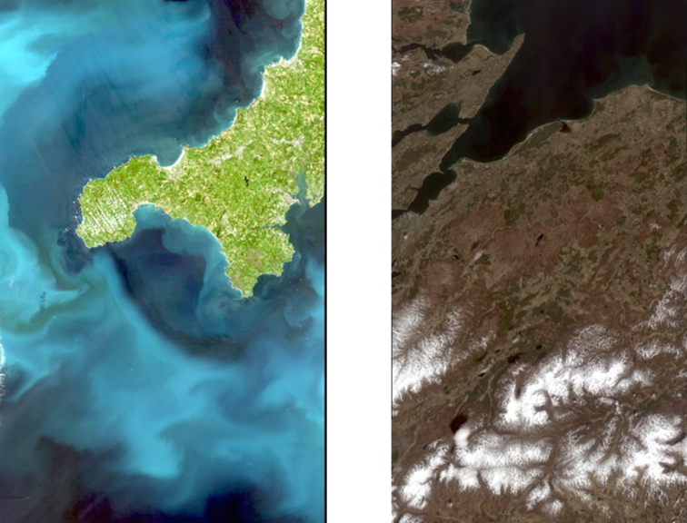
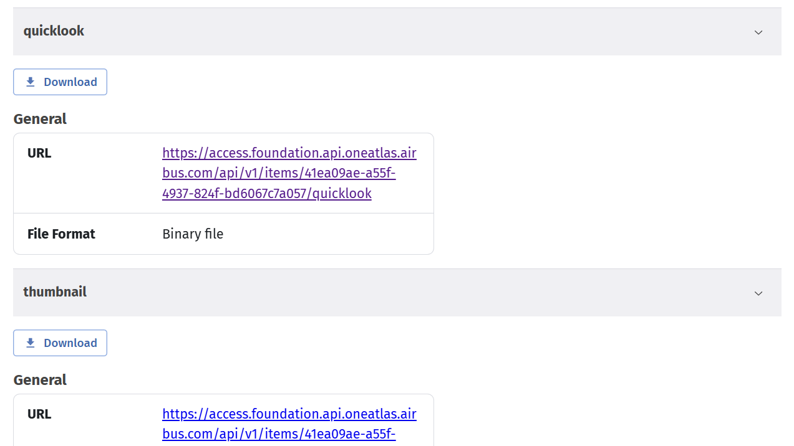
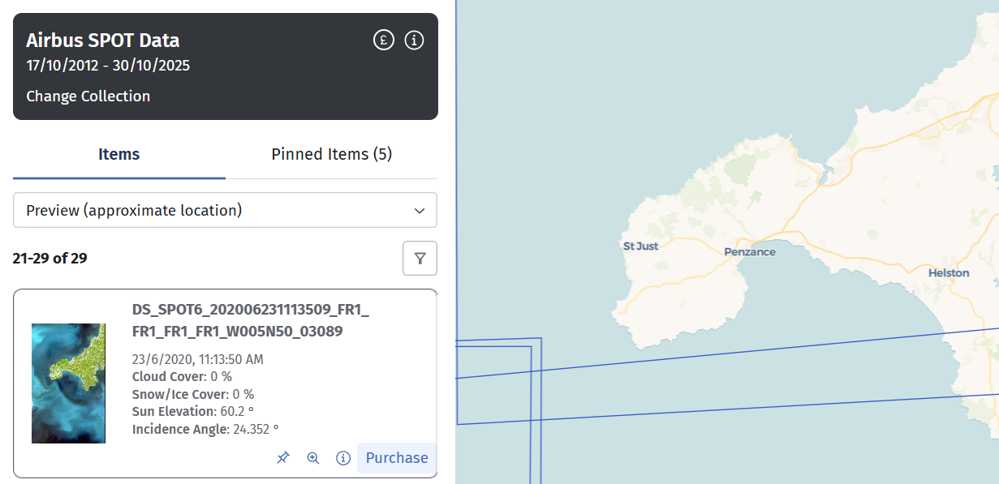
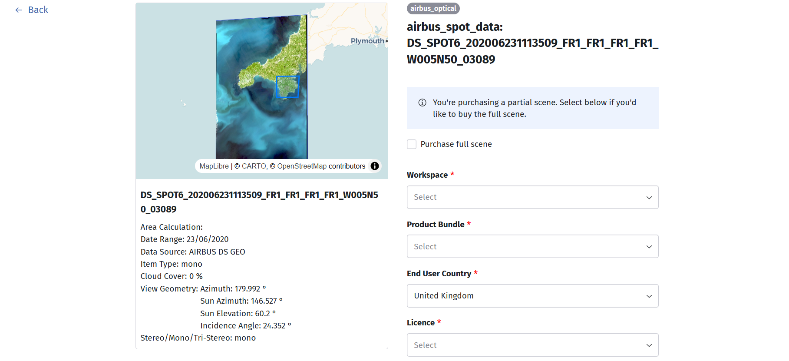

## Find the data you need

### Search and browse

Searching for the imagery you are looking to purchase is currently possible within our [Resource Catalogue interface](https://eodatahub.org.uk/static-apps/sg-rc-ui/prod/index.html#/finder/sentinel2_ard) or directly [through our APIs](https://eodatahub.org.uk/docs/documentation/apis/).

Use the Resource Catalogue to find the data you need. You can filter on [commercial collections](https://eodatahub.org.uk/static-apps/sg-rc-ui/prod/index.html#/?license=lic%3Acommercial) within the Resource Catalogue to discover which collections are available from the currently supported commercial providers. Alternatively, we have an example notebook scripts to help get you started searching for data programmatically, using [pyeodh](../APIs/api-intro.md)(find them in our training materials section of this documentation).

### Using the Resource Catalogue

Once you have opened a commercial data collection, using the left-hand panel, search for the data you are looking to find by using the available filters. An area of interest should be drawn on the map, and a temporal extent for the data search can be selected via calendar input. The user can also refine the parameters based on max cloud cover and look angle using the slider widgets. The search is carried out automatically once you have applied the chosen filters by selecting the blue _Apply_ button.

All imagery from the Resource Catalogue matching the search parameters is then displayed in a pop out panel adjacent to the left hand panel. The user can scroll through the list to search the available data. Acquisition date and time are displayed per image, as well as the cloud coverage (%), and a thumbnail snapshot of the imagery.

### Checking thumbnails
A thumbnail or quicklook is a low-resolution preview version of the commercial image, typically in JPEG or PNG format, that provides a visual summary of the full-resolution satellite data. It can be viewed prior to placing an order. It allows the user to visually check the content of the image for cloud, quality, or coverage of a specific asset, before purchasing. This allows the user to make informed purchasing decisions.

 
_Figure: Low-resolution quicklook thumbnails for Cornwall, UK (left) and Caringorms, Scotland (right)_

!!! note
    Some data thumbnails for commercial imagery provided by Airbus require the user to be logged in to their EODH account.

!!! tip
    To download a quicklook thumbnail, open the data item by clicking the 'i' icon, and got to 'Assets'. If you open the available dropdown menus, you should be given the option to download. From there, you can view the low-resolution thumbnail as you would a normal image file.
    

### Ordering interface
From here, the user can purchase an item from the catalogue by selecting 'Purchase' on the item card on the left-hand panel.

This will take you through to the ordering interface, which should look something like the image below. The available ordering fields will vary depending on the data type and the data provider. For example, a SAR data order requests additional, more specific field options. The 'Purchase full scene' checkbox will only be visible if you have drawn an AOI polygon i.e. allowing you to clip your order to the AOI which was drawn.

The next page in the guide will outline each order field. For help understanding the specific requirements of the order needed for your application, it is best to contact support for the data provider directly. Alternatively, reach out to [enquiries@eodatahub.org.uk](mailto:enquiries@eodatahub.org.uk) who will be able to put you in touch with the data specialists.
