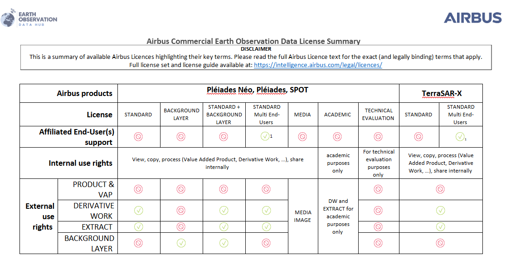

# License restrictions

## Airbus

Airbus imagery is available against a comprehensive set of licenses covering a range of different use cases and industrial organisations. Airbus’ standard licence set are published on our website. See below for a one-page simplified licence matrix demonstrates the license features at a glance.

!!! question
     __How can I become a licence expert?__

     1) [Download the Airbus guide](https://eur03.safelinks.protection.outlook.com/?url=https%3A%2F%2Fstorage.googleapis.com%2Fp-ssp-iep-prod-8ff-strapi-uploads%2Fr68290_495_airbus_intelligence_licence_guide_102021_2_b62f735aaa%2Fr68290_495_airbus_intelligence_licence_guide_102021_2_b62f735aaa.pdf&data=05%7C02%7Cgln8%40leicester.ac.uk%7C193def341e9c455a8db508de1df88d28%7Caebecd6a31d44b0195ce8274afe853d9%7C0%7C1%7C638981150584405888%7CUnknown%7CTWFpbGZsb3d8eyJFbXB0eU1hcGkiOnRydWUsIlYiOiIwLjAuMDAwMCIsIlAiOiJXaW4zMiIsIkFOIjoiTWFpbCIsIldUIjoyfQ%3D%3D%7C0%7C%7C%7C&sdata=eq66%2FQWnYUzc3I2%2FaxqhJ8TVMPR1xGi6oBwnexk33gA%3D&reserved=0)!
     
     2) Discover the current Airbus licence set
     
     3) Understand the main elements of Airbus licences
     
     4) Become a licence expert :smiley:

## Planet

Planet offers standard licenses to suit different use cases e.g., Commercial, R&D, Education, Publication. More detailed definitions for the Planet license agreements can be found on the Planet website.

For new Planet customers to arrange for a Planet license to access Planet data via EODH, please contact eodatahub@planet.com. Existing Planet accounts can be accessed via the EODH by using their API key. Please use these instructions if you need help locating your API key.