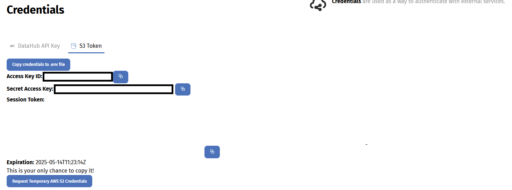

# Using your temporary AWS S3 credentials

This page explains how to use the temporary S3 credentials provided by our platform. Whether you prefer the command line or a bit of Python, we’ve included examples to help you get started quickly.

## Generating Your Temporary Credentials

1. Log in to your account.
2. Click on the Workspaces tab at the top.
3. Select the Credentials tab.
4. Click on the S3 Token sub-tab.
5. Finally, click the Request Temporary AWS S3 Credentials button. A popup similar to the one below will appear:



```bash
Access Key ID: e.g. ASIATNVEVXXXXX
Secret Access Key: e.g. eeLV8XXXXX
Session Token: e.g. IQoJb3JpZXXXXX
Expiration: e.g. 2025-02-18 16:17:54 +0000 UTC
```

!!! warning
    These credentials are temporary and expire after 1 hour. Make sure you generate new ones before they expire.

## Understanding Your Credentials

* Access Key ID & Secret Access Key: These work together as your username and password for accessing your S3 bucket.
* Session Token: This is an extra security token needed to verify your session.
* Expiration: This tells you when the credentials will no longer be valid. Credentials last for 1 hour from the time they are generated.

Remember, you’ll need all three items when connecting to S3.

## Using the AWS CLI

If you haven’t already, please install the AWS CLI. Then, set your credentials in your shell session:

```bash
export AWS_ACCESS_KEY_ID="ASIATNVEVXXXXX"
export AWS_SECRET_ACCESS_KEY="eeLV8XXXXX"
export AWS_SESSION_TOKEN="IQoJb3JpZ2luX2VjEGgaCWV1LXdlc3XXX"
```

You can then list the contents of your S3 bucket:

```bash
aws s3 ls s3://workspaces-eodhp/example-workspace/
```

To upload a file, use the `cp` command:

```bash
aws s3 cp my-file.tif s3://workspaces-eodhp/example-workspace/my-file.tif
```

To upload a whole directory recursively, add the `--recursive` flag:

```bash
aws s3 cp ./my-data/ s3://workspaces-eodhp/example-workspace/my-data/ --recursive
```

## Using the s3cmd tool

If you prefer using `s3cmd`, you can configure it using your temporary credentials:

Run the configuration command:

```bash
s3cmd --configure
```

When prompted, enter your Access Key, Secret Key, and Session Token as required. To list your bucket contents, use:

```bash
s3cmd ls s3://workspaces-eodhp/example-workspace/
```

To upload a file:

```bash
s3cmd put my-file.tif s3://workspaces-eodhp/example-workspace/my-file.tif
```

To upload a whole directory recursively:

```bash
s3cmd put --recursive ./my-data/ s3://workspaces-eodhp/example-workspace/my-data/
```

## Using Your Credentials in Python

For those who prefer to work in Python, the boto3 library is the easiest way to interact with S3. If you don’t have it installed, you can install it with:

```py
pip install boto3
```

Here’s how to initialise the S3 client with your temporary credentials:

```py
import boto3

s3 = boto3.client(
    ‘s3’,
    aws_access_key_id=’ASIATNVEVXXXXX’,
    aws_secret_access_key=’eeLV8XXXXX’,
    aws_session_token=’IQoJb3JpZ2luX2VjEGgaCWV1LXdlc3XXX’
)

bucket_name = ‘workspaces-eodhp’
```

To list objects in your workspace:

```py
response = s3.list_objects_v2(Bucket=bucket_name, Prefix="example-workspace")

if ‘Contents’ in response:
    for obj in response[‘Contents’]:
        print(obj[‘Key’])
else:
    print("No objects found in the bucket.")
```

To upload a file:

```py
s3.upload_file(
    Filename=’my-file.tif’,
    Bucket=bucket_name,
    Key=’example-workspace/my-file.tif’
)
```
