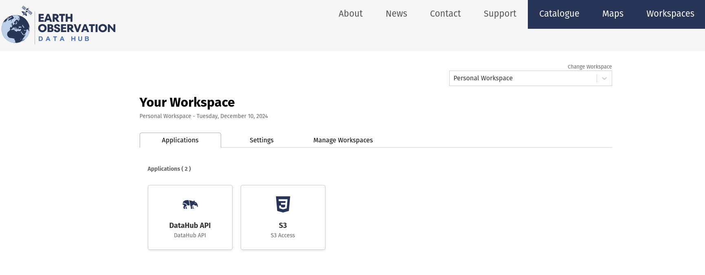
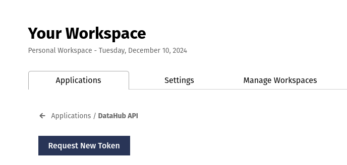

# pyeodh API

## Introduction

As part of the EODH project, `pyeodh` has been created as a lightweight Python client for easy access to EODH APIs.

An API client is a software tool or library designed to simplify interactions between a user’s application and an external API (Application Programming Interface). In the case of `pyeodh`, it is a Python-based tool tailored to facilitate communication with the specific API endpoints exposed by the EODH platform. Using `pyeodh`, developers and scientists can programmatically access the API’s features—such as sending requests, retrieving data, or executing commands—without needing to handle the underlying details such as crafting HTTP requests or managing authentication manually.

By abstracting these complexities, `pyeodh` makes it easier to integrate the API into Python applications, enabling developers to focus on building features rather than managing low-level networking tasks.

## Why is `pyeodh` needed?

A key group of expected users are data scientists, and the key tools for this group tend to be written in Python. The `pyeodh` API client will simplify the interaction with the EODH platform allowing for more rapid, frictionless scientific development.

## Running workflows

Access to the EODH platform is largely free and open. However, in order to complete tasks on the workflow runner (WR) you will require an API token. To generate the token you will require a user account whch can be requested by contacting [enquiries@eodatahub.org.uk](mailto: enquiries@eodatahub.org.uk). Once you have the account, login and navigate to ‘Workspaces’. Under the ‘Applications’ tab click on the ‘DataHub’ as shown in the screenshot below. From there you will be able to generate a new API token and manage other tokens that you have access to.

