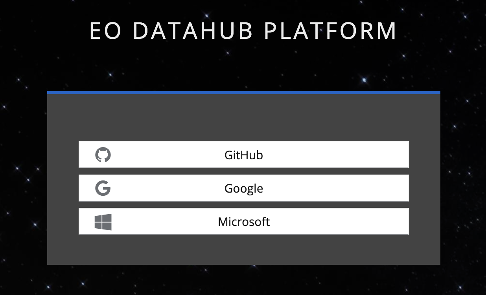

**For All Users (Logged In or Logged Out):**

In the Search Panel, users can select a dataset, Area of Interest (AOI), and date range to perform a general search. After performing a general search, users can: Browse results by viewing the true-color images on the map and view metadata for each search result. 

**For Logged-In Users Only:**

Users can log in using their GitHub account, provided it is registered on the EO Data Hub Platform. Once logged in, the "Action 
Creator" mode is enabled. Logged-in users can access the Action Creator Panel to design and run workflows, visualize and 
analyze workflow results and use predefined workflow presets. Logged-in users can also benefit from features such as workflow 
history tracking, workflow results download and the ability to import/export workflows in Action Creator.

