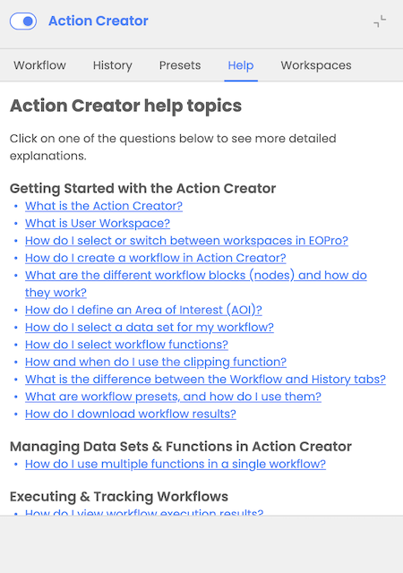

The Action Creator Help section is available exclusively for logged-in users, providing comprehensive guidance on using the Action Creator and its functionalities. This help section is accessible through a dedicated Help tab within the Action Creator interface. 

The Action Creator Help includes information on how to use the Action Creator efficiently, designing and executing workflows,utilizing functions and presets to streamline workflow creation and working with the tools such as graphs, measurement tool and comparison tool. 

The information is structured in a question & answer format, allowing users to quickly find relevant information: 

**Getting Started with the Action Creator**

What is the Action Creator?

How do I create a workflow in Action Creator?

What are the different workflow blocks (nodes) and how do they work?

How do I select a data set for my workflow?

How do I select workflow functions?

What is the difference between the Workflow and History tabs?

What are workflow presets, and how do I use them?

How do I download a workflow results? 

**Managing Datasets & Functions in Action Creator**

How do I use multiple functions in a single workflow?

How do I filter workflow results by time using the time slider?

**Executing & Tracking Workflows**

How do I view workflow execution results?

How do I track the execution progress of my workflow?

How do I view workflow execution notifications?

What happens if I switch to Action Creator while having a search session active?

Can I save my workflow for future use?

What happens if I run multiple workflows at the same time?

How do I cancel a running workflow?

How do I access my saved workflow results or configuration? 

**Working with Actions (Presets and Functions)**

What is Land Cover Changes scenario?

What is Water Quality Analysis scenario?

What is the colour coding for Land Cover Change classes?

What is the colour coding for Water Quality Analysis?

What is the colour coding for NDVI?

What is the colour coding for EVI?

What is the colour coding for SAVI?

**Working with Graphs**

How do I view graphs for my data?

What types of graphs are available, and what do they represent?

How do I adjust the time range displayed on graphs? 

**Measurement & AOI Management**

How do I measure distances and areas on the map?

**Comparison & Layer Management**

How do I use the comparison tool? 

 
