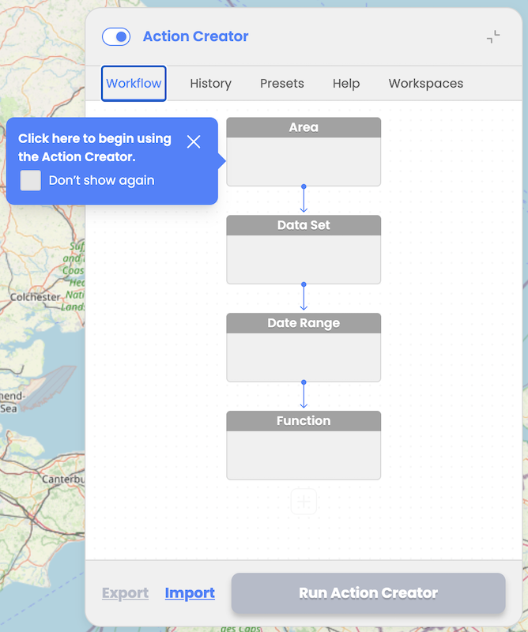

**Workflow Tab:** Enables users to design workflows using interactive nodes/blocks for AOI selection, Data Set selection, Date Range, and one or multiple consecutive Functions

**History Tab:** Displays list of previously executed workflows with status updates (Processing, Ready or Failed) with the option to load successfully executed workflow results

**Presets Tab:** Provides pre-configured workflows to assist inexperienced users or save time for experienced users. At the moment user can select Land Cover Changes and Water Quality Analysis preset.

**Help Tab:** Provides help content explaining how to operate Action Creator, details about the data sources and functions available, detailed explanation of the provided predefined scenarios with the references to the scientific papers, list and description of the resulting assets indices and classes, etc.. More detailed explanation can be found in chapter “Action Creator: Help”.

**Workspaces Tab:**  Provides users with the possibility to select between hos own Workspaces available in EODH platform.

User workspace is a storage that is managed by the user in EODH. Conceptually you can treat it as a folder on your drive. It is mainly used as a storage for the user's workflow results, but can also allow user to store workflows and data. It provides the facility for users to analyze data, process datasets, make commercial orders and generate valueadded outputs within the hosted Hub environment. User can create more than one workspace.

  
