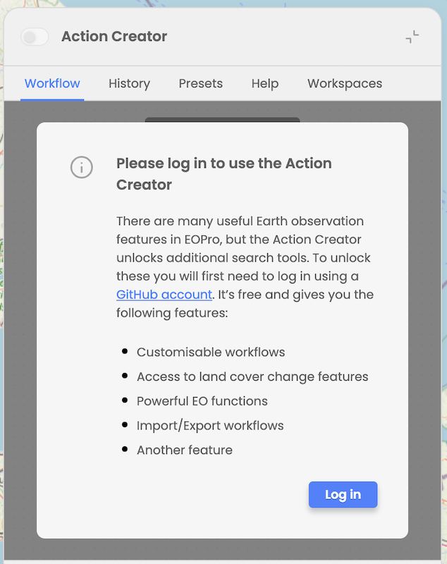

User cannot activate Action Creator mode while not logged in. When expanding Action Creator and try to operate theAction Creator, the user is informed that he needs to log in with GitHub account and he is provided with details about the features that will be unlocked upon logging in. 

  
