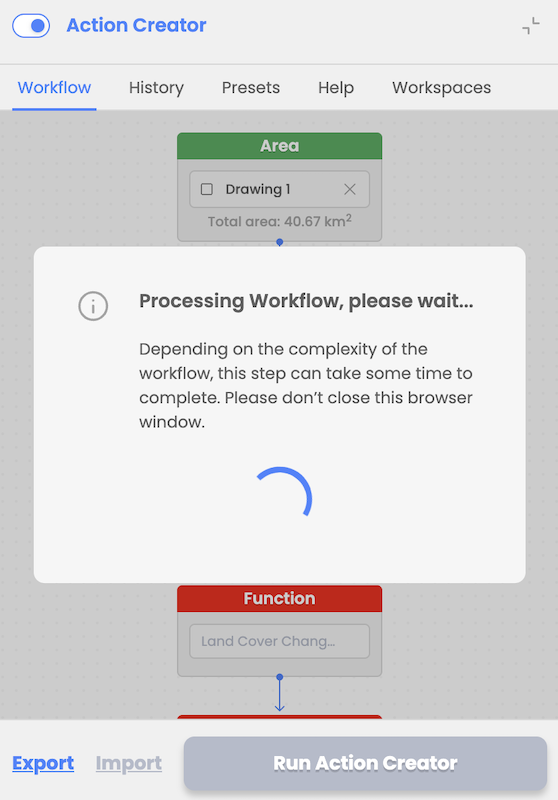
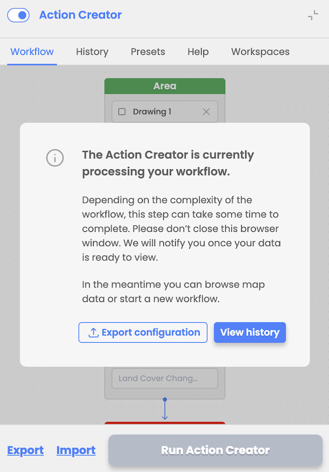

Workflow execution is possible once all nodes are filled properly (validation of input parameters ensures compliance with EODH capabilities). After the user selects to run workflow, the workflow inputs are processed in CWL file that is sent to the EODH backend.

In case processing fails user will receive an error message but no detailed/technical description of a fail will be included.

  

  

  

  

The user is notified via a modal window upon workflow execution and is provided with an option to view the results and option to export or import workflow design and inputs explained in the following chapter. 

  
