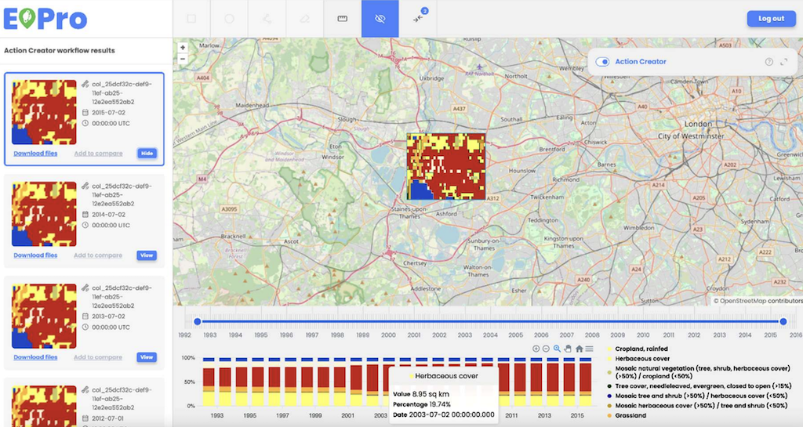
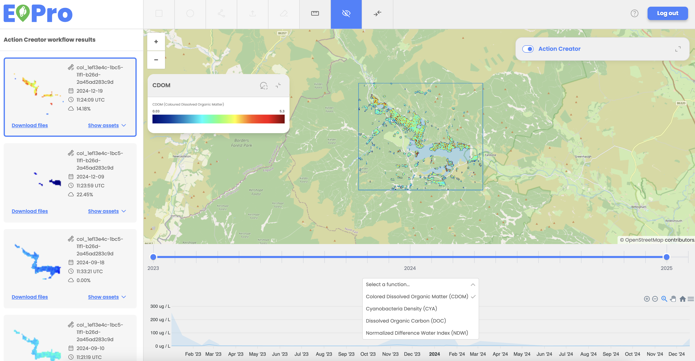

Workflow results are displayed as overlays on the map displaying true color images and corresponding assets listed in the left-hand panel. Users can check asset details and select to view asset’s true color image on the map. 

Users can view and analyze workflow result assets data in the graph below the workflow results. Graphs are generated automatically for applicable workflows, displaying results based on the selected functions, such as NDVI values or Land Cover classes. 

Two types of charts are available:

- Line Chart (for NDVI, SAVI, EVI, and Water Quality Analysis): 
    - Displays minimum, maximum, and median values for each timestamp.
- Stacked Bar Chart (for Land Cover Change analysis):
    - Each bar represents land cover percentages across different classes (e.g., wetlands, grasslands).
    - Clicking a legend item filters the graph to display only the selected land cover class. 

Users can utilize the time slider tool to adjust the displayed data range, which is automatically reflected in the respective graph. 

Stacked Bar Chart – Land Cover Change example:

 

 
Line Chart - Water Quality Analysis example:

