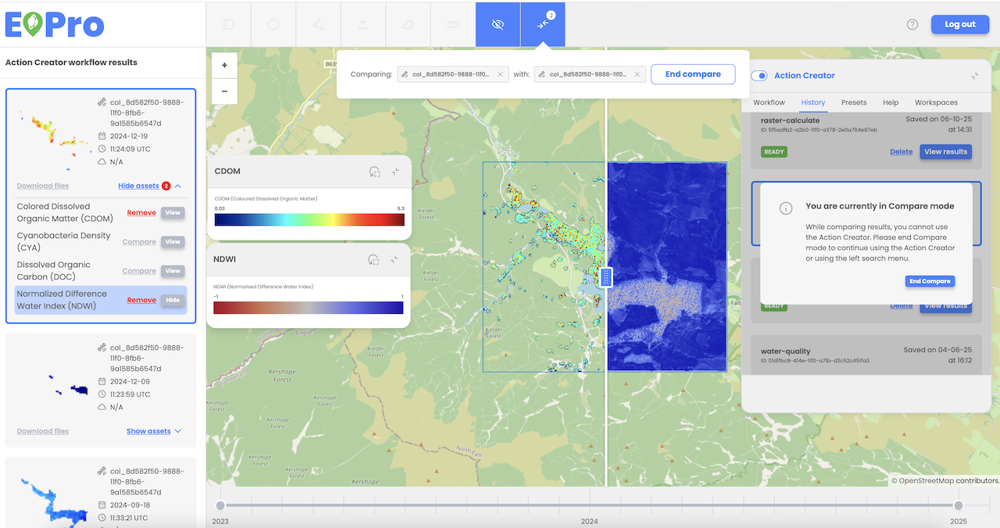

The user can utilize the comparison tool to compare two assets. To do this, the user must select two assets by choosing the ‘Add to Compare’ option for each desired asset and then clicking the ‘Compare’ button in the comparison widget. Assets can be compared from search mode, Action Creator mode (workflow results), or a combination of both. 

Once in comparison mode, the user can analyze differences between the two assets using a vertical slider that overlays them in separate layers. The compared assets can be updated at any time within the comparison widget. To exit comparison mode, the user can select the ‘End Compare’ option.

 
