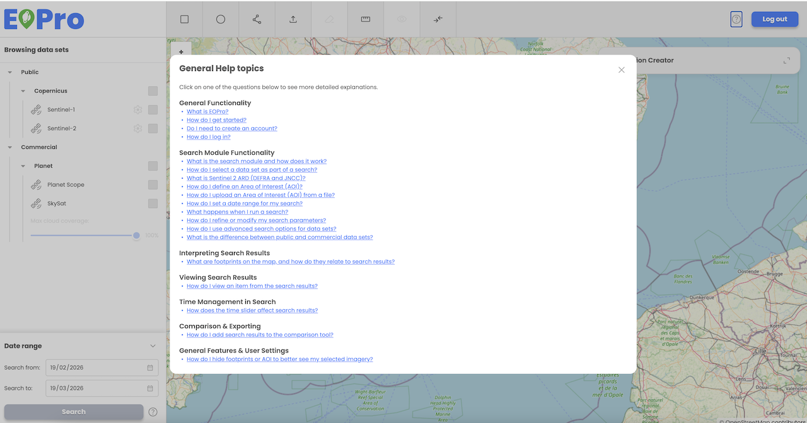

The EOPro application provides a General Help section, enabling users to easily access information about the application and its functionalities. This feature is accessible to both logged-in and non-logged-in users.

Users can access General help by clicking on the “question” icon located in the main toolbar. 

General Help provides general information about the application and includes details on functionalities available specifically for non-logged-in users. 

Help is organized in a questions & answer format to ensure easy navigation: 

**General functionality**

What is EOPro?

How do I get started?

Do I need to create an account?

How do I log in? 

**Search Module Functionality**

What is the search module and how does it work?

How do I select a data set as part of a search?

How do I define an Area of Interest (AOI)?

How do I set a date range for my search?

What happens when I run a search?

How do I refine or modify my search parameters?

How do I use advanced search options for datasets?

What is the difference between public and commercial datasets?

**Interpreting Search Results**

What are footprints on the map, and how do they relate to search results?

**Viewing Search Results**

How do I view an item from the search results? 

**Time Management in Search**

How does the time slider affect search results? 

**Comparison & Exporting**

How do I add search results to the comparison tool? 

**General Features & User Settings**

How do I hide footprints or AOI to better see my selected imagery?

 
