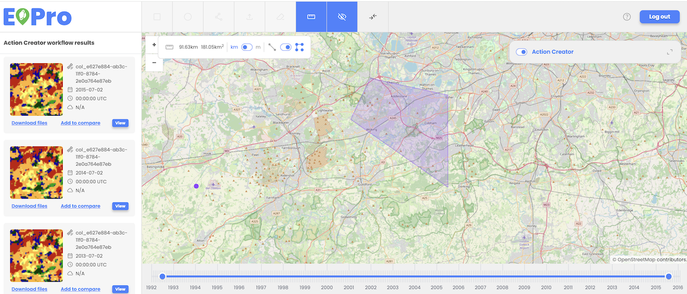

Users can measure distances and areas on the map and related assets using the measurement widget. The distance measurement tool allows users to draw multiple lines with automatically calculated distances, while the polygon tool enables users to create polygons with automatically calculated areas. The calculated distance and area can be displayed in both kilometers and miles. 

 
