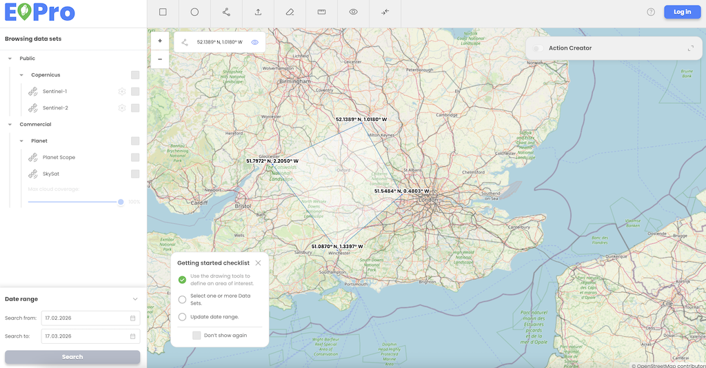

User can define an Area of Interest (AOI) by drawing a polygon, rectangle, or circle, which will be used as one of the search parameters.

The AOI can be adjusted or redrawn before finalizing the search.

A checklist at the bottom guides users through the three essential steps for performing a search: AOI selection, dataset selection, and date range selection.    

