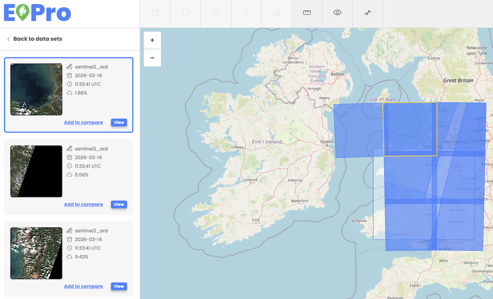

User can select individual assets from the list of items on the left side. Users can click the "View" button or image miniature within the item to display the specific item on the map as a true color image. 

The EOPro application provides an interactive footprint and asset highlighting feature, enhancing user experience by providing navigation of the search and workflow results. This functionality ensures seamless interaction between the map view and the search or workflow results panel.

**Footprint highlighting on mouse hover:**

When users hover over a footprint on the map, it is visually highlighted 

**Asset focus on footprint click:**

Clicking on a footprint in the map view automatically focuses and highlights the corresponding asset in the workflow results panel on the left side.

**Footprint highlighting on asset thumbnail mouse hover:**

When a user hovers over an asset in the Action Creator results, the respective footprint on the map is highlighted. 

**Footprint hiding with the eye icon:**

Users can utilize the eye icon to toggle footprint and AOI visibility, in order to declutter the map for better visualization.

  

