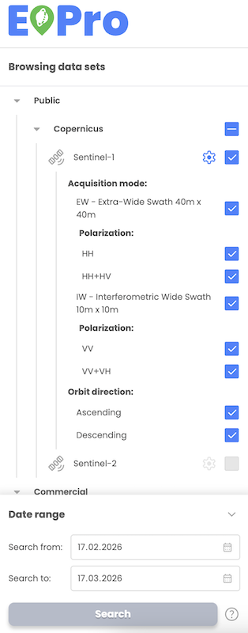

* User can configure advanced features for selected data sets, such as:
    * Sentinel 1:
        * Acquisition mode
        * Polarization
        * Orbit direction
    * Sentinel 2 ARD:
        * Max. cloud coverage
    * Planet data:
        * Max. cloud coverage
* Validation is implemented for the selection of advanced features (e.g. the user has to select at least EW or IW acquisition mode for Sentinel-1).
* If the user does not explicitly configure the advanced features, default settings will be automatically applied in the background.   

