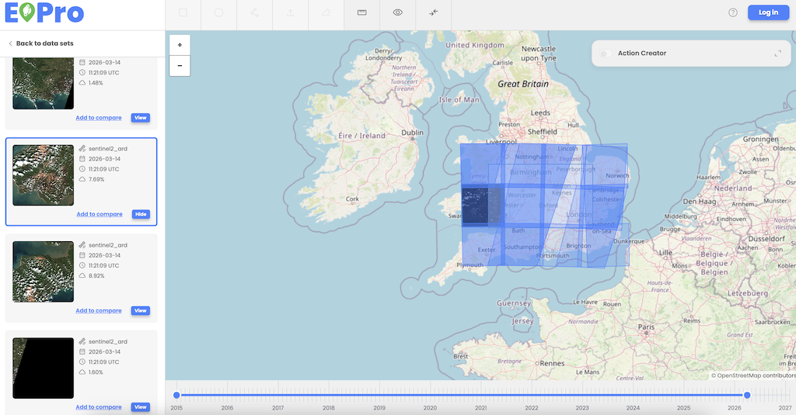

After selecting the Data Set, AOI, and Date Range, user can press the Search button to perform a search based on the specified criteria. 

* Search results are displayed as items/thumbnails listed in the left-side menu. 
* The list of items corresponds to the specified time range.
* Each item intersects with the AOI drawn by the user. 
* Each item corresponds to the dataset(s) selected by the user.
* Each item is described by the following properties:
    * Data set
    * Date
    * Time (UTC)
    * Cloud coverage

  

