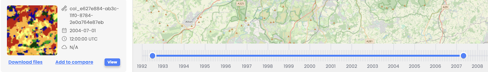

Time Slider Tool allows users to filter workflow results per date range and enables focused analysis of changes over specific time intervals by providing possibility to narrow and expand initially set time range boundaries. Time slider tool is integrated with the workflow results presented in the graphs tool.

 
