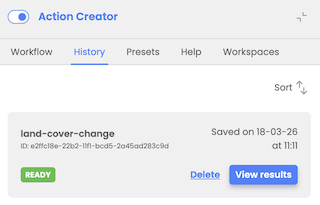
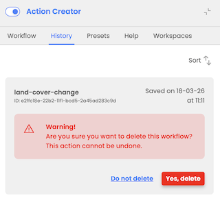
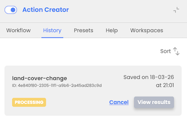
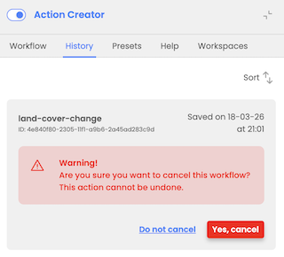

# Delete and cancel workflows

The Action Creator History provides users with functionalities for managing workflows, including deleting processed workflows and canceling those still in-progress:

- User can select to delete already processed workflows that are in Ready or Failed status

- User can cancel workflow that is in in-process status

