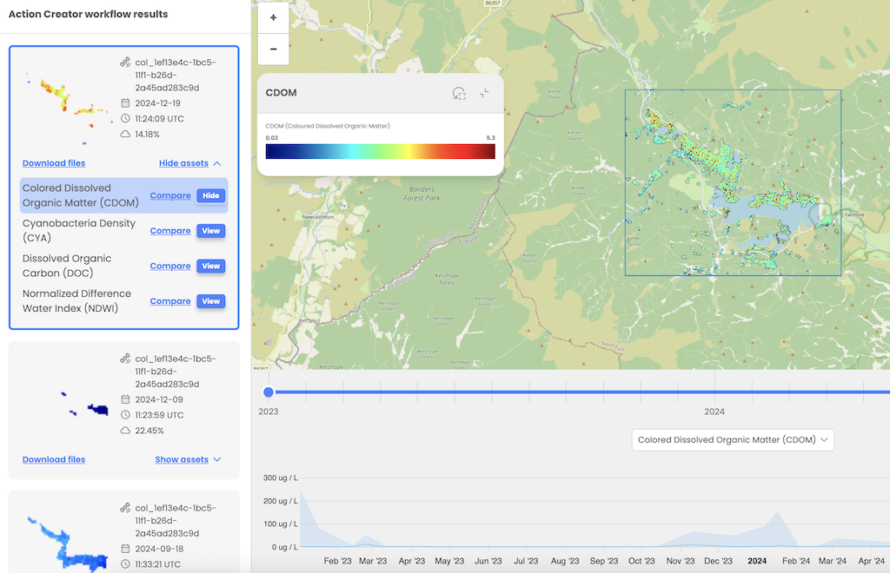

# Multi-index assets

The EOPro application provides a feature that allows users to view and compare items containing multiple indices, enhancing the ability to fully analyze workflow outcomes.

This functionality is particularly beneficial for Water Quality Analysis.

Upon selection of the asset containing multiple indices users are presented with available indices such as:

- CDOM (Colored Dissolved Organic Matter)
- CYA (Cyanobacteria Bloom Indicator)
- DOC (Dissolved Organic Carbon)
- NDWI (Normalized Difference Water Index)

Then user can choose to view individual indices for detailed examination or add selected indices to comparison tool

