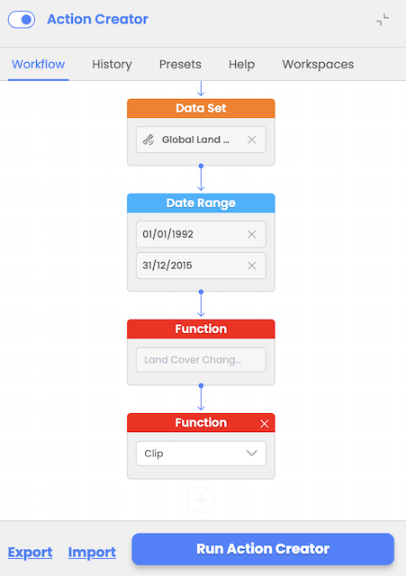

# Multiple functions

Action Creator Workflow Designer allows users to combine consecutive multiple functions (e.g., NDVI with clipping) within a single workflow.

Sequential execution ensures output from one function serves as input for the next.

With built validation rules workflow designer ensures that incompatible functions or datasets are disabled to prevent errors during execution.

The possibility of parallel usage of functions is one of the functionalities coming in future phases.

