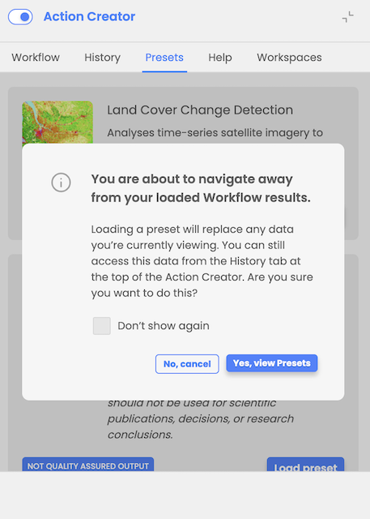
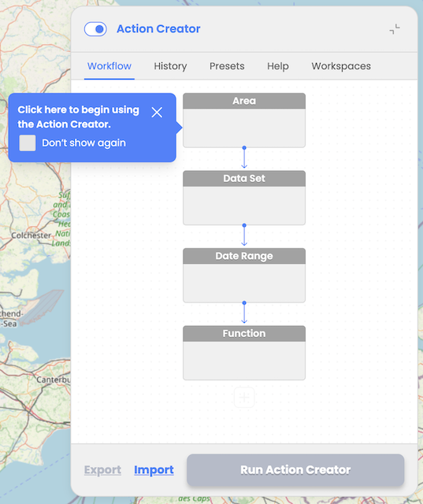

# Action creator mode

The user must be logged in with a GitHub account registered on EODH to access Action Creator mode. Once logged in, the user can:

* Design Workflows: Create workflows by sequentially adding nodes to define the Area of Interest (AOI), select datasets, set date ranges, and choose processing functions.
* Execute and Monitor: Run workflows and track their progress (Processing, Ready, or Failed) via the History tab.
* Import/Export Workflows: Save workflow configurations as JSON files for later reuse or sharing.
* Use Presets: Quickly set up common analyses with pre-configured presets like Land Cover Change Detection or Water Quality Analysis.
* Visualize and Compare Results: View outputs as map overlays and dynamic charts for detailed analysis and comparison tool for comparing two resulting assets.

# Log in

User cannot activate Action Creator mode while not logged in. When expanding Action Creator and try to operate the Action Creator, the user is informed that he needs to log in with GitHub account and he is provided with details about the features that will be unlocked upon logging in.

# Layout

**Workflow Tab:** Enables users to design workflows using interactive nodes/blocks for AOI selection, Data Set selection, Date Range, and one or multiple consecutive Functions

**History Tab:** Displays list of previously executed workflows with status updates (Processing, Ready or Failed) with the option to load successfully executed workflow results

**Presets Tab:** Provides pre-configured workflows to assist inexperienced users or save time for experienced users. At the moment user can select Land Cover Changes and Water Quality Analysis preset.

**Help Tab:** Provides help content explaining how to operate Action Creator, details about the data sources and functions available, detailed explanation of the provided predefined scenarios with the references to the scientific papers, list and description of the resulting assets indices and classes, etc. More detailed explanation can be found in chapter "Action Creator: Help".

**Workspaces Tab:** Provides users with the possibility to select between his own Workspaces available in EODH platform.

User workspace is a storage that is managed by the user in EODH. Conceptually you can treat it as a folder on your drive. It is mainly used as a storage for the user's workflow results, but can also allow user to store workflows and data. It provides the facility for users to analyze data, process datasets, make commercial orders and generate value added outputs within the hosted Hub environment. User can create more than one workspace.

# Navigation

When attempting to navigate to the Workflow tab or Presets tab while having previously loaded workflow results, the user is informed that the loaded results will be replaced and provided with instructions on how to access them again. The user is prompted to confirm before proceeding. He can still navigate to the Help tab without losing already loaded workflow results.

When designing a workflow, the user is guided through the steps of the workflow design process with interactive tooltips. User can choose to turn off interactive tooltips.

