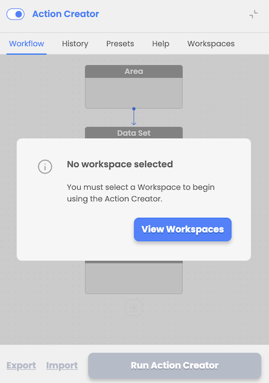
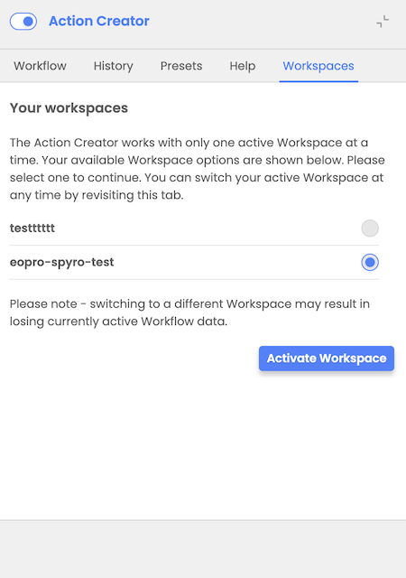

# Switching between workspaces

User workspace is a storage that is managed by the user in EODH. It is mainly used as a storage for the user's workflow results, but can also allow user to store workflows and data. It provides the facility for users to analyze data, process datasets, make commercial orders and generate value-added outputs within the hosted Hub environment. User can create more than one workspace.

Upon initial login, user is prompted to select and activate one of his workspaces from the Workspaces Tab.

Later, at any time, user can switch between available workspaces by revisiting the Workspaces tab, selecting and activating a different workspace.
