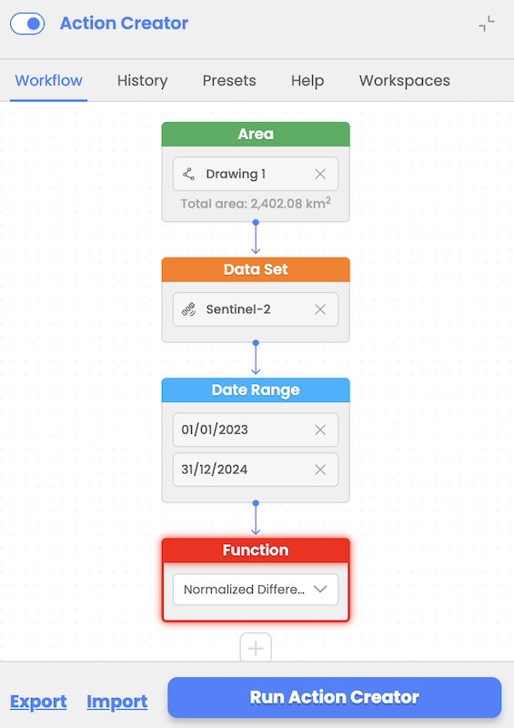
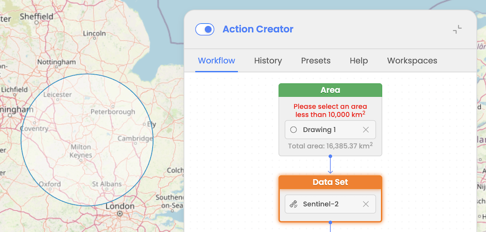
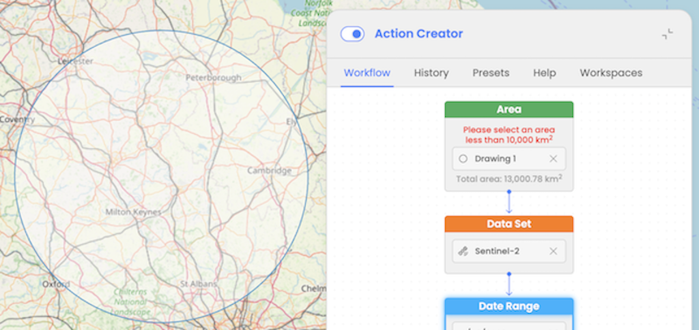
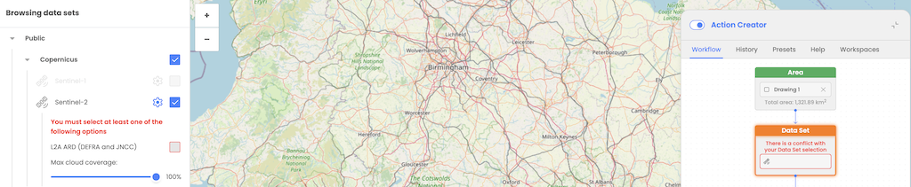
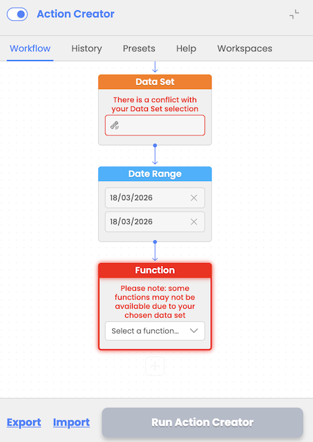

# Workflow design

Provides no-coding tool to enable user to design workflows by using available interactive nodes for:

* Area of Interest selection
* Data Set selection
* Date range selection
* Function/s selection (e.g. LLC, NDVI, etc..)

Action Creator ensures that nodes are completed in sequence. Two-way validation ensures compatibility between data sets and functions selected. The workflow builder supports adding multiple consecutive functions for advanced processing.

Users can select an Area of Interest (AOI) for workflow input, with a maximum limit of 10,000 km². User will be informed with the message that AOI selected should be smaller than maximum allowed one.

If user selects an AOI larger than this threshold then a validation error will be displayed and user will be prevented to execute a workflow.

This limit has been set to support for large AOIs. This enhancement enables the generation of smaller "chips" from the selected AOI, leveraging CWL's Scatter operator to process workflows efficiently.

# Workflow design validations

Action Creator provides workflow validations on the front-end side during workflow design and backend validations used as a safety mechanism during workflow execution.

Frontend validations:

- ensures users select valid datasets, date ranges, and compatible functions
- validates area of interest size (e.g., must be under 10000 km²). If user selects AOI greater than that, the validation error will prevent user from running a workflow. This limit can be increased in the future based on overall EODH capabilities.

Backend validations:

- checks for errors like exceeding resource limits or invalid input parameters. These validations are executed on the EODH backend side and EOPro is ensuring that the user is informed about the execution issue in the UI.

To improve the user experience and help users in the workflow design process, additional validations have been implemented to ensure that users configure workflows correctly before execution and preventing errors and misconfigurations.

Key validations include:

Warning Messages for Missing Data Sources:

If a user attempts to proceed without selecting an appropriate data source, a warning message is displayed, prompting them to choose a valid dataset.

Function and Action Restrictions:

If no valid data source is selected, users are prevented from applying functions or actions, ensuring workflows are designed with properly configured inputs.

