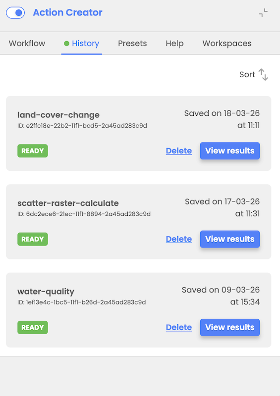

# Workflow execution

Workflow execution is possible once all nodes are filled properly (validation of input parameters ensures compliance with EODH capabilities). After the user selects to run workflow, the workflow inputs are processed in CWL file that is sent to the EODH backend.

In case processing fails user will receive an error message but no detailed/technical description of a fail will be included.

The user is notified via a modal window upon workflow execution and is provided with an option to view the results and option to export or import workflow design and inputs explained in the following chapter.

# Workflow history

User can track history of executed workflows in the Workflows History tab where he is presented with the list of executed workflows with their statuses (In Processing, Ready or Failed). Beside status, user is presented with details like workflow ID, name, date, and time of execution.

User has possibility to load workflow results if workflow is executed successfully.

An automatic status refresh with a notification in the History tab (green dot indicator) when workflow execution status is updated will be implemented as an improvement in a near future.

# Workflow import and export

During workflow design, the user can choose to export their workflow design and inputs as a JSON file to local storage. This file can later be imported to restore the workflow or it can be shared with coworkers. Upon importing the workflow design, the user can modify workflow inputs as needed before triggering workflow execution again.

