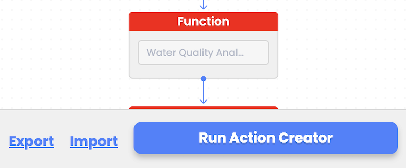

# Workflow import and export

During workflow design, the user can choose to export their workflow design and inputs as a JSON file to local storage. This file can later be imported to restore the workflow or it can be shared with coworkers. Upon importing the workflow design, the user can modify workflow inputs as needed before triggering workflow execution again.

