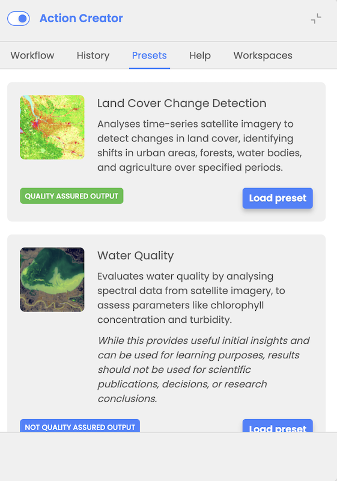

# Workflow presets

In the Action Creator Presets tab user is provided with pre-configured workflows to assist inexperienced users or save time for experienced users by providing quick access for specific cases.

At the moment user can see two presets available:

- Land Cover Changes scenario preset
- Water Quality Analysis preset

User has the option to select a preset and load it as a workflow. Upon selection, the user will be redirected to the Workflow tab, where all required nodes are automatically populated with predefined values associated with the selected preset. The user can optionally modify these values before executing the workflow.

