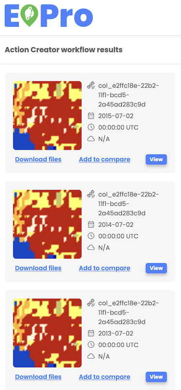

# Workflow results download

Users can download a workflow or search results by selecting the 'Download' option in the asset details menu on the left side menu. The respective files, including resulting images and metadata for the selected item, will be downloaded locally.

For multiple files contained within one item, each file initiates its download in a separate browser tab, and depending on the browser's settings, the user might need to approve the download for each tab individually.

