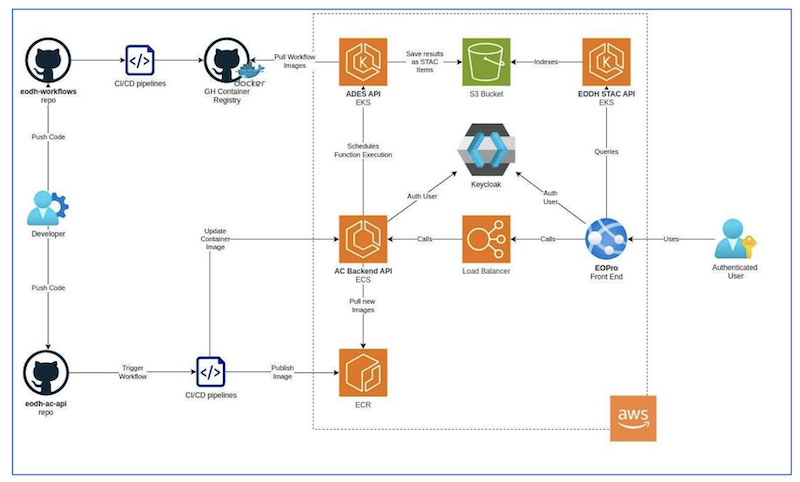

# High level architecture

The architecture of the Backend API is designed to be modular and scalable, supporting a wide range of functionalities while ensuring ease of maintenance and future enhancements. It is built using FastAPI, with containerized deployment on AWS.

