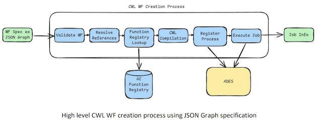

# CWL file dynamic generation

In EOPro, workflows are represented using a JSON Graph notation, similar to the approach used by Netflix's Falcor for modeling data relationships. This notation provides an intuitive and flexible representation of workflows, enabling tasks to reference other tasks as prerequisites and facilitating management of complex dependencies.

The JSON Graph structures tasks as nodes within a graph, with references indicating dependencies between them. This representation ensures that workflows are both readable and executable and simplifies the process of translating them into CWL for ADES processing. 

## Workflow specification

The workflow specification is structured as a JSON object containing three primary keys: inputs, functions, and outputs. Each of these keys plays a critical role in defining the workflow's overall configuration and execution. 

- **inputs:** this section maps to the global workflow inputs, such as area, dataset, date_start, and date_end. These parameters establish the foundational context for the workflow, serving as boundaries and filters applicable across all tasks.
- **outputs:** specifies the STAC collections that will be generated upon successful execution of the workflow. Currently, only one output per workflow can be defined, though this may be extended to support multiple outputs as the solution evolves.
- **functions:** represents a graph of individual tasks (or steps) that need to be executed within the workflow. Each function is defined as a WorkflowStep and can reference the global inputs and outputs. To ensure controlled data flow, only one step in the graph is permitted to have a direct reference to the outputs.

This structured approach enables the robust and scalable definition of workflows, supporting clear dependencies and logical data flows while ensuring future extensibility. 

## Workflow execution flow

The execution process involves several key steps:

1. **Validation:**  The submitted JSON workflow specification undergoes validation to ensure it meets all required constraints.This includes checking the structure, ensuring valid references, and verifying the compatibility of function inputs and outputs. 
2. **Reference Resolution:** Each reference within the workflow is resolved, ensuring that inputs and outputs for each step are accurately linked and that dependencies between steps are properly managed. 
3. **CWL Translation:** The validated workflow is translated into a CWL file specification. CWL, a widely used standard for defining complex, reproducible workflows, allows for interoperability across various geospatial processing systems.
4. **Process Registration:** The CWL workflow specification is registered as a process within the user's workspace on ADES, making it available for execution. Registration is managed through the OGC Processing API, which enables ADES to recognize and manage the workflow. 
5. **Workflow Execution:** Upon registration, a request is sent to execute the workflow using the specified input parameters from the JSON workflow. This triggers ADES to begin processing the workflow tasks, utilizing the specified geospatial data and parameters.

This execution flow allows users to define and run complex geospatial workflows directly within the Action Creator, leveraging ADES for scalable processing and resource management. By managing the entire workflow lifecycle from submission to execution, the platform provides a robust solution for executing structured geospatial analyses.

## Workflow design boundaries

When designing workflows for EOPro, certain limitations must be considered due to the requirements of the ADES platform and the structure of the workflow specification. These limitations are outlined below:

- **Output Requirements:** The ADES platform expects the final output to be a directory containing a STAC Catalog JSON file,along with its corresponding Collections, Items, and asset files referenced in the Item JSON files. The creation of Collections is dynamically managed by ADES, with no direct control from EOPro.

- **Graph Constraints:** The workflow graph must be a fully connected, directed, acyclic graph (DAG). Cycles and self-loops are not supported, and each task must flow to the next without circular dependencies. Additionally, conditional step execution is not supported, meaning that all defined tasks will execute sequentially without conditional branching.

- **Single Workflow Execution:** Only a single workflow (DAG) can be executed at a time. Running multiple independent workflows concurrently is not supported.

- **Function Limitations:** Only functions listed in the *GET /actioncreator/functions* endpoint of the AC Backend API are supported. Custom functions that are not part of this predefined list cannot be used.

- **Output Mapping:** The global output for the workflow must map to a single output from one of the steps in the task graph. Steps with outputs that are not referenced in subsequent steps or mapped to the global output are considered “dangling” and will result in validation errors, as they waste computational resources without contributing to the workflow’s final output.

- **Task Limit:** Workflows are limited to a maximum of 10 tasks (steps) to ensure manageable complexity and optimize resource usage. 

- **Dataset Compatibility:** All steps within the workflow must be compatible with the selected dataset.

- **Step Output Compatibility:** The output of one step must be compatible with the inputs of the subsequent step. For instance, attempting to compute NDVI (Normalized Difference Vegetation Index) from SAVI (Soil-Adjusted Vegetation Index) is invalid, as the data structures do not match.

- **Path References:** All path references within the workflow must resolve correctly. References to non-existent functions or outputs will result in validation errors.

- **Area and Date Constraints:**
    - **Area Size:** The maximum allowable area size is 1000 square kilometers.
    - **Date Range:** If provided, the end date must be later than or equal to the start date.

These boundaries are designed to ensure that workflows are properly configured for reliable and efficient processing on the ADES platform. Adhering to these constraints helps avoid validation errors and ensures optimal execution of
workflows. 