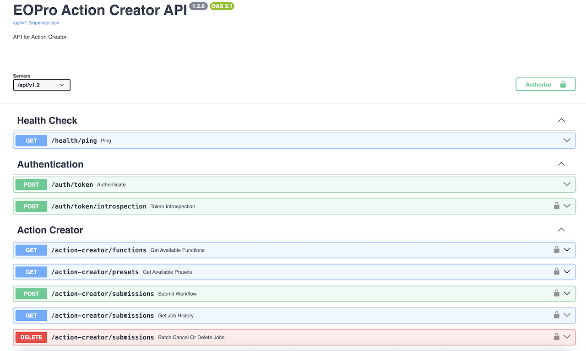
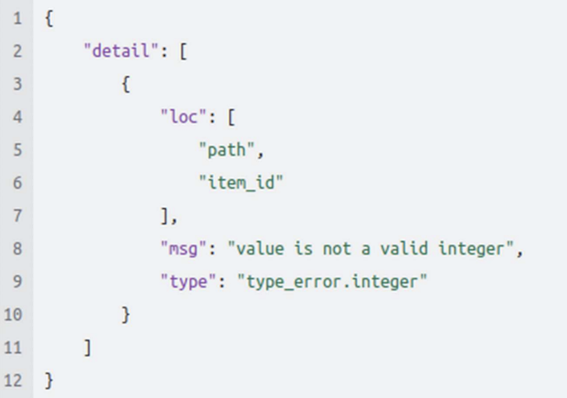

# API documentation

Detailed documentation of each API endpoint, including method types, required parameters, and expected responses can be found after opening Swagger UI:
[https://staging.lot2.eodatahub.org.uk/api/v1.2/docs](https://staging.lot2.eodatahub.org.uk/api/v1.2/docs)

Following EOPro Action Creator API endpoints has been implemented:

- Health check
- Authentication
- Listing available Action Creator Functions
- Listing available Action Creator Presets
- Getting WF execution history
- Getting WF execution status
- Cancelling or deleting WF execution from history

## Error handling and status codes

Usually, the API returns 422 Unprocessable Entity error code with appropriate error model pointing out which field contains errors if user defined request is invalid. An example of such response is given below:

## Development and testing

Please refer to the [API documentation](https://github.com/EO-DataHub/eodh-ac-api) hosted on GH for more details on how to set up a local development environment and run unit and integration tests. Currently there are over 600 individual unit and integration tests for the API alone.
