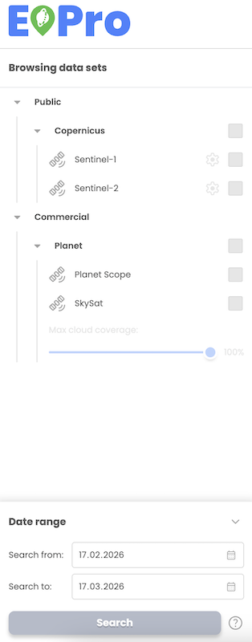

# Dataset selection

* User can view a list of available datasets from Public (Copernicus data provider) and Private/Commercial (Planet data provider) sources.
* User can select datasets from Sentinel-1, Sentinel-2 and Planet.
* Users can initiate search datasets from Sentinel-1, Sentinel-2 ARD and Planet data (Planet Scope, SkySat) catalogues available through EODH Hub.

