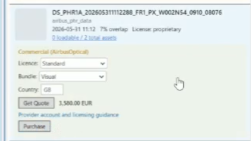

## Purchasing Commercial Imagery

Commercial items are highlighted with a gold border. The purchase workflow depends on the provider:

| Provider | Licence Required | Country Required |
|----------|:----------------:|:----------------:|
| Airbus Optical | Yes | Yes (ISO-3 code) |
| Airbus SAR | Yes | No |
| Planet | No | No |

### Purchase Steps

1. Select a licence from the dropdown (if required).
2. Enter the end-user country code (if required).
3. Click **Get Quote** to see the price.
4. Review the price and currency displayed.
5. Click **Place Order** and confirm the purchase.

You can track order status in the **Workspace** tab.

In the workspaces view, it's possible to see previously bought data that's been purchased through the system, or uploaded to a workspace. Scrolling through the data items it is possible to see different status messages for the items depending on whether the purchase was successful, failed or is pending.

It is possible to expand the details for a given item and see the available assets. Th edata asset should be automatically selected but you can use the check-boxes to choose the assets of interest. Then click the "__Load Into Map__" button and the checked assets will (if spatial in nature) load directly into the GIS map pane. This this may take a minute or two depending on the size of the asset.

It's important also to note that if you're purchasing data, you will need access to a billing account.
