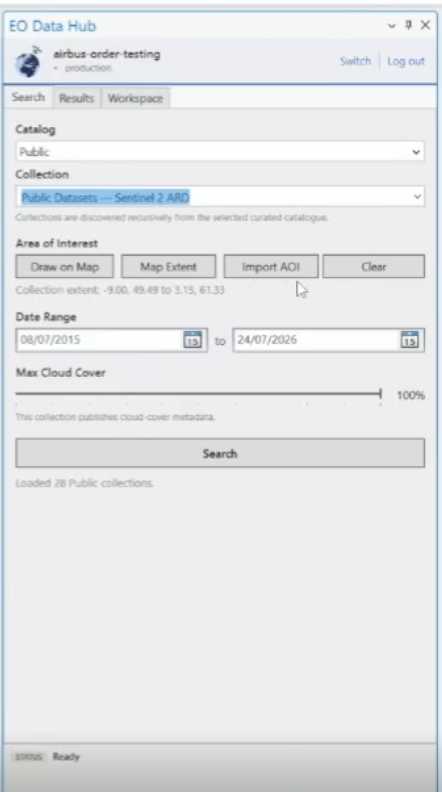
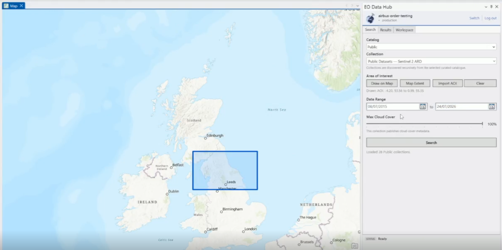
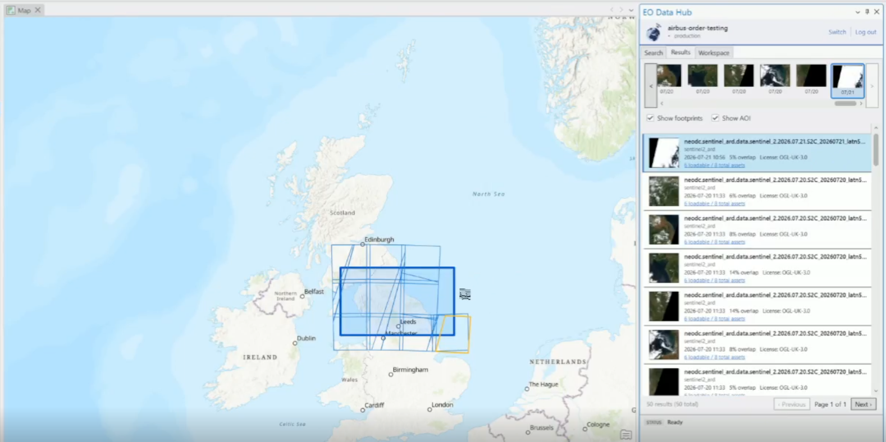
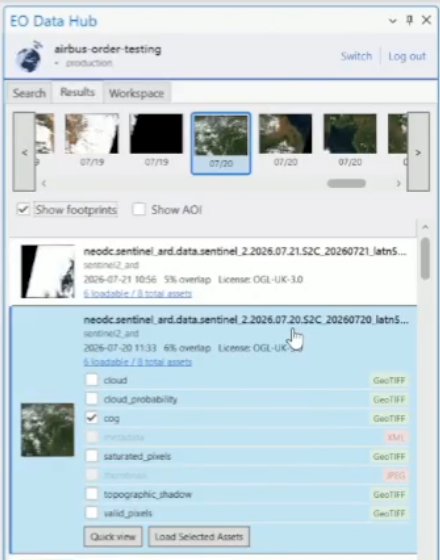

## Searching for Data

The **Search** tab lets you define filters and query the EODH catalog.

### 1. Select a Catalog and Collection

Use the dropdown menus at the top of the Search tab to choose a catalog and, optionally, a specific collection within it.

### 2. Define an Area of Interest (AOI)

Choose one of four methods:

| Method | Description |
|--------|-------------|
| **Draw on Map** | Click the button, then draw a rectangle on the map canvas |
| **Map Extent** | Use the current map view as the AOI |
| **Import GeoJSON** | Load a boundary from a `.geojson` or `.json` file |
| **Clear** | Remove the current AOI |

### 3. Set Date Range

Use the date pickers to define the start and end dates for your search. By default, this covers the last two months.

### 4. Set Max Cloud Cover

Drag the slider to set a cloud cover threshold (0–100%). Only results at or below this value will be returned.

### 5. Run the Search

Click **Search**. A summary will show how many items were found.

## Browsing Results

Results appear in the **Results** tab.

### Timeline

A scrollable timeline strip at the top shows thumbnail previews of each result arranged by acquisition date. Use the **Previous** / **Next** buttons or scroll to navigate. Clicking a thumbnail highlights the corresponding item in the list below.

### Results List

Each result displays:

- **Thumbnail** preview
- **Item ID** and **Collection**
- **Acquisition date**
- **Resolution** (metres)
- **Cloud cover** (%)
- **AOI overlap** (%)

### Selecting Assets

Click on a result to expand its asset list. Each asset shows its type (COG, GeoTIFF, etc.) and whether it can be loaded. Use the checkboxes to select the assets you want, then click **Load Selected Assets**.

You can also **double-click** a result to load its selected assets directly into the map.

