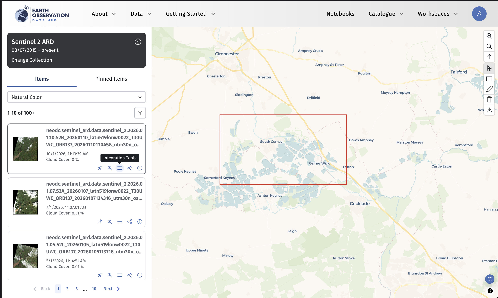
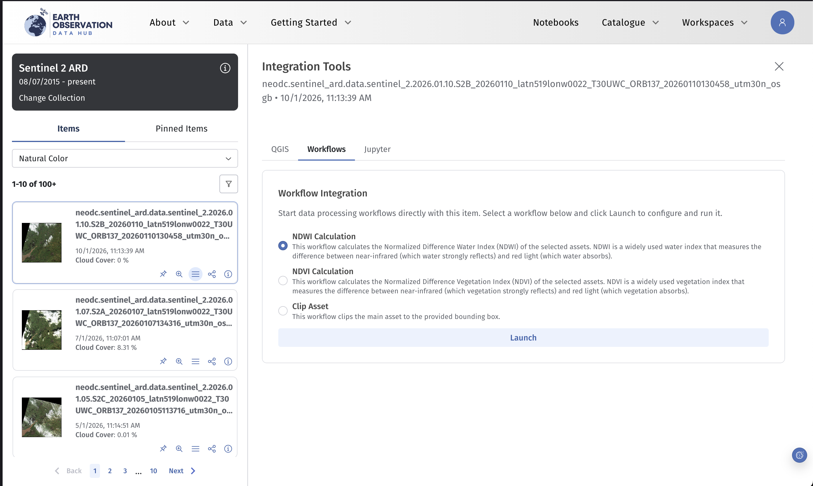
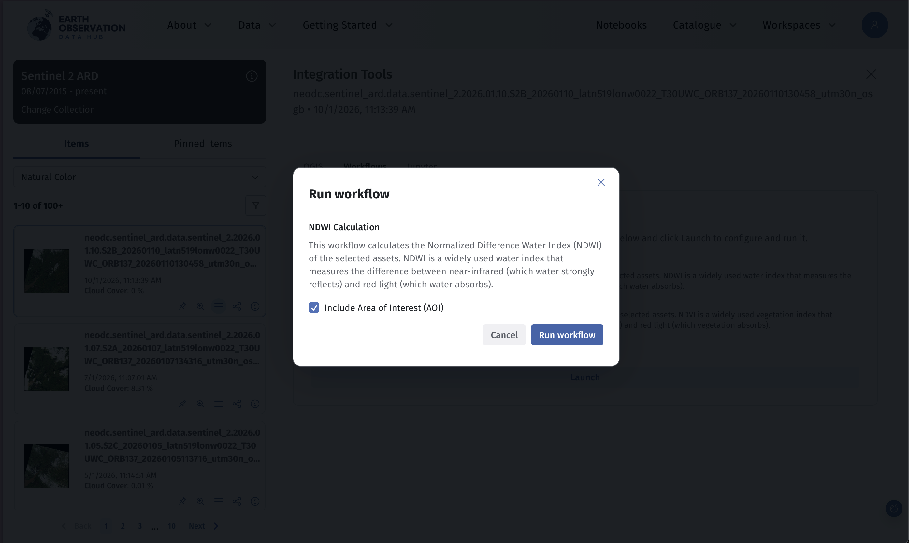
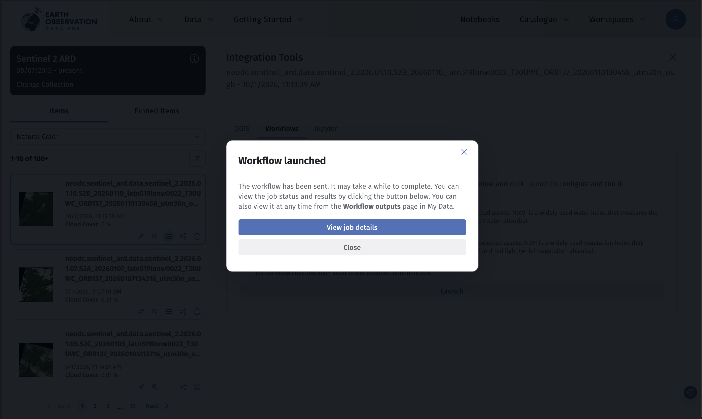
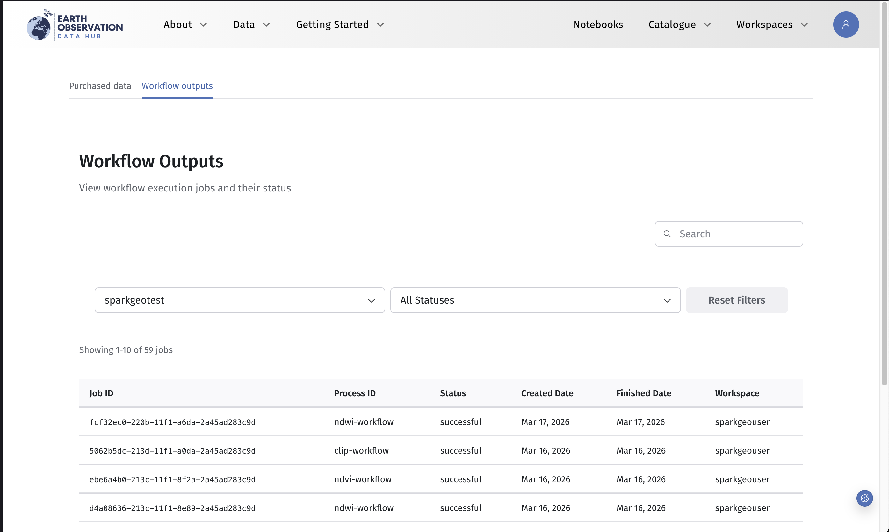
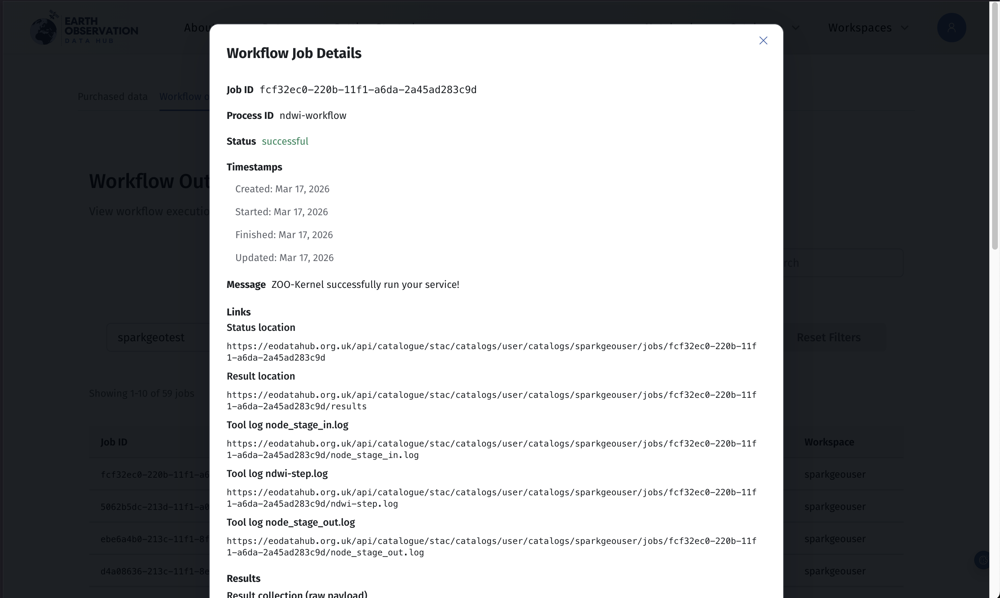
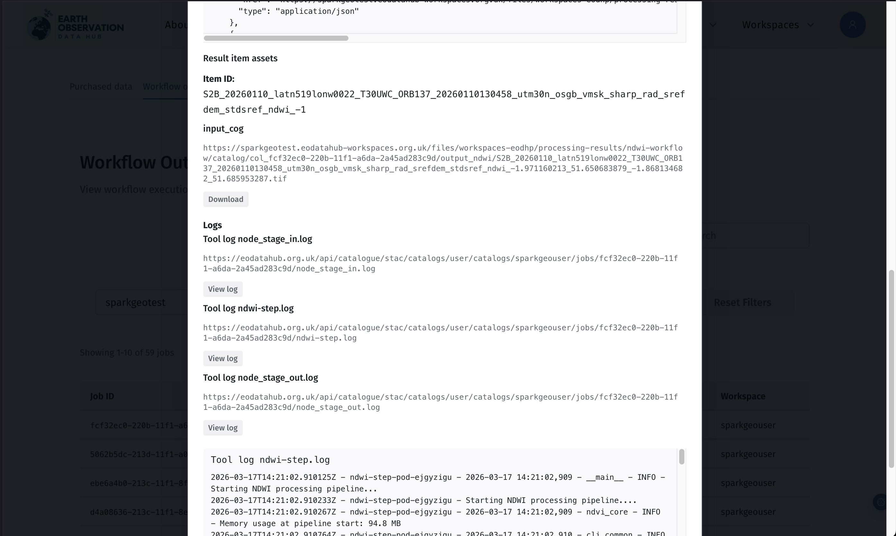
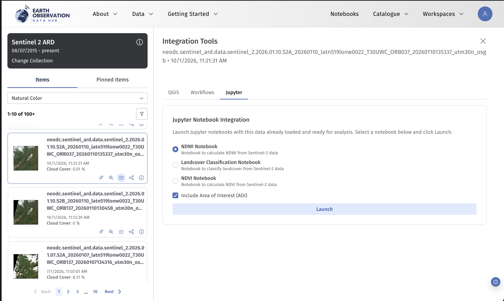
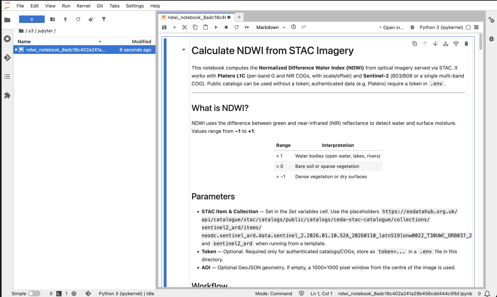
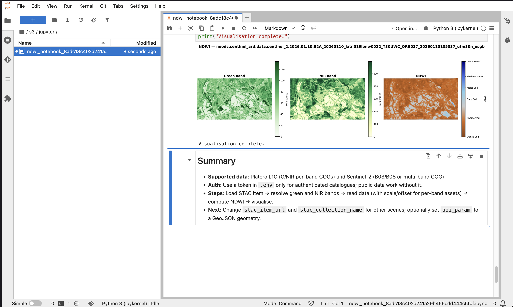

# Running Workflows and Notebooks on the Hub

## Select a dataset

1.  First, find a collection relevant to your task.
2.  Then browse or search within that collection to locate a specific data item.
3.  Open the data item and click **Integration tools**.

## Running Workflows

### Launch a Workflow

1.  Open the **Workflows** tab.
2.  A list of available workflows for the dataset will appear.
3.  Select a workflow and click **Launch**.

### Configure and Run

1.  A dialog will appear with a description of the workflow.
2.  If you have defined an Area of Interest (AOI) on the map, you can choose to run the workflow only for that area.
3.  Click **Run Workflow** to start the process.

### After Launch

Once started, you will see:

- A link to **View job details**, or
- The option to close the dialog (you can access jobs later via **My Data**).

## Viewing Workflow Outputs

### Access Job Details

- Click **View job details** immediately after launching, **or**
- Go to **My Data → Workflow outputs** and select a job.

### What You'll See

- Job status and progress
- Creation time and metadata
- Download links for generated outputs
- Logs (useful for troubleshooting errors)

!!! note
    This page may take some time to load depending on the job.

## Running Notebooks

### Launch a Notebook

1.  In **Integration tools**, select the **Jupyter** tab.
2.  Choose a notebook from the list.
3.  Optionally include your selected AOI.
4.  Click **Launch Notebook**.

### Using the Notebook

- The notebook opens in a new browser tab.
- Dataset details are pre-filled for you.

You can:

- Run cells
- Modify parameters
- Explore and extend the analysis

If an AOI was selected, outputs will be clipped to that area.

## Notes

- Workflows run as managed jobs on the platform, and outputs are stored in your workspace.
- Notebooks provide an interactive environment for custom analysis and experimentation.
- Both workflows and notebooks operate within your workspace, which manages your data and processing resources.
