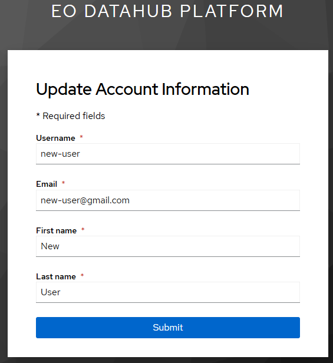
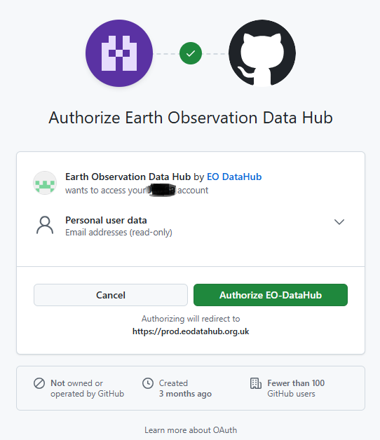

# Sign In

This guide walks you through the steps to register as a user to the platform using your chosen identity provider (i.e. GitHub, Google, or Microsoft). This tells the EODH who you are, and associates your user identity on the Hub with an existing email address.

## Access permissions
Once signed in to the platform, you can:
- Access the Workspaces tab
- Be added to an EODH workspace managed by another EODH user (this would provide the same access as users with a billing account)

You will not yet have permissions to:
- Create or manage a workspace

[Understand what this account level provides 🔐](https://docs.eodatahub.org.uk/Getting-Started/access-levels/){ .md-button }
[Enable workspace creation and management 💻](https://docs.eodatahub.org.uk/Getting-Started/billing-accounts/){ .md-button }

## Sign in
To initially register as a user of the EODH, click on the 'Sign in' button on the homepage. This can be found in the top right corner.
 

This will bring you to a sign in page. 

!!! "Prerequisite"
- To create an account on the Hub you must have either a GitHub, Gmail or Microsoft account
- If you don't already have one of the above, first create a GitHub, Gmail, or Microsoft account

Click on one of the available identity providers on the sign in page.


This will prompt you to input your chosen identity provider's user credentials. Logging in for the first time will also prompt you to update account information, as shown below.



Input the required fields to complete registration.

---

## Sign in via GitHub
### Authorisation step
When logging into the hub for the first time via GitHub, you will be asked to authorise EO-DataHub using GitHub keycloak, so the account can be used to login.



--- 

## Sign in via Microsoft
Once you have selected the Microsoft sign in button, this will trigger an email to be sent to the address linked to your Microsoft account. The subject of the email will be:  
   ✉️ **"Request for access to eodh-prod received"**


!!! note
- 🔒 The requested application will appear as: **`eodh-prod`**
- ⌛ The request is valid for **24 hours** from the time it is sent, after which the request will expire
- ⚠️ If this happens, you will receive an email with the subject **"eodh-prod access request has expired"**

After your Microsoft sign-in request is sent, approval is required at the organisation level.

### Next steps

- 📨 Your sign-in sends a request to your *Microsoft Administrator*, usually handled by your organisation’s IT team
- ✅ They must approve access to the **`eodh-prod`** application as a one-time action
- 👥 Once approved, access is enabled for your entire organisation. Anyone in your organisation can sign in via Microsoft in a one-click step.

You may need to contact your *Microsoft Administrator* directly, and explain what **`eodh-prod`** is and why you require access. If you’re unsure who your *Microsoft Administrator* is, contact your IT support team.

### Pre-approving Microsoft access for your team or organisation
To make sign-in faster and smoother, your *Microsoft Administrator* can pre-approve access before users attempt to log in. This allows instant access on first sign-in.
To do this, identify your organisation’s *Microsoft Administrator* and send them the guidance below:

External tenant administrators can pre-approve access by visiting:
```
https://login.microsoftonline.com/{TENANT-ID}/v2.0/adminconsent
```
Replace `{TENANT-ID}` with your organisation’s Microsoft Entra tenant ID.

See the Microsoft reference documentation here: https://learn.microsoft.com/en-us/entra/identity-platform/v2-admin-consent

--- 

## Sign in via Google

